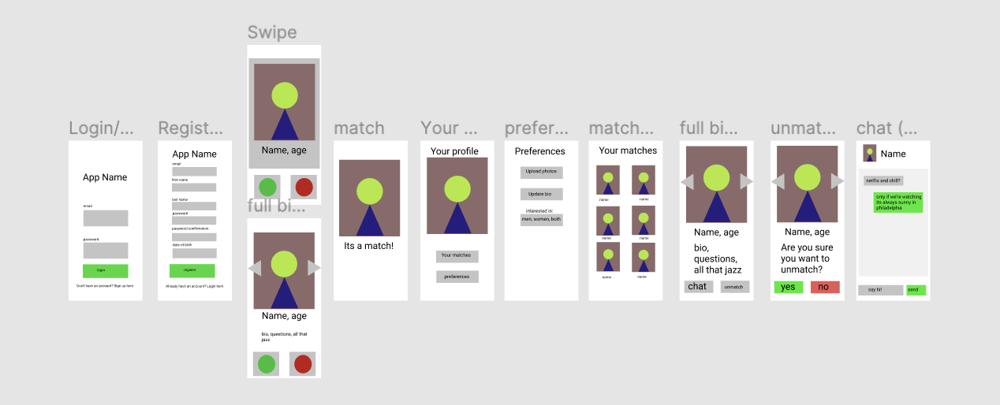
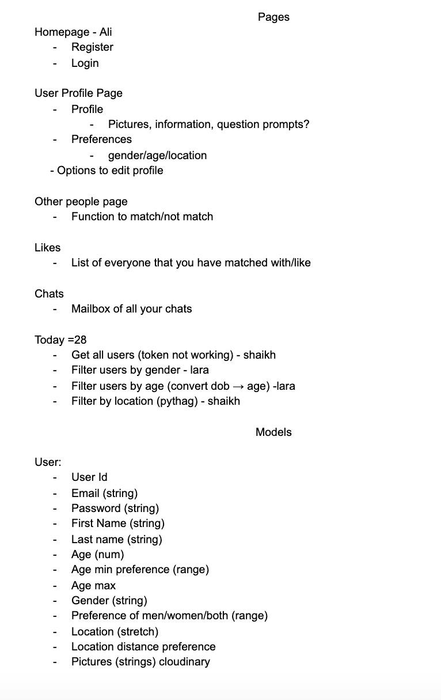
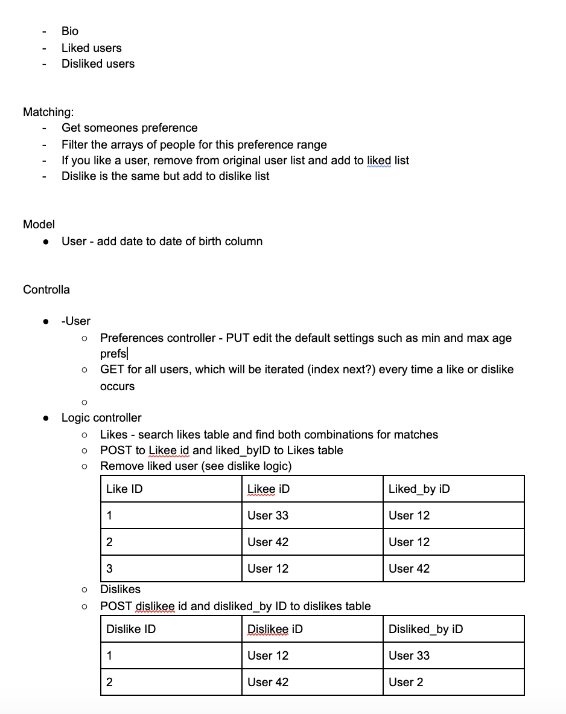
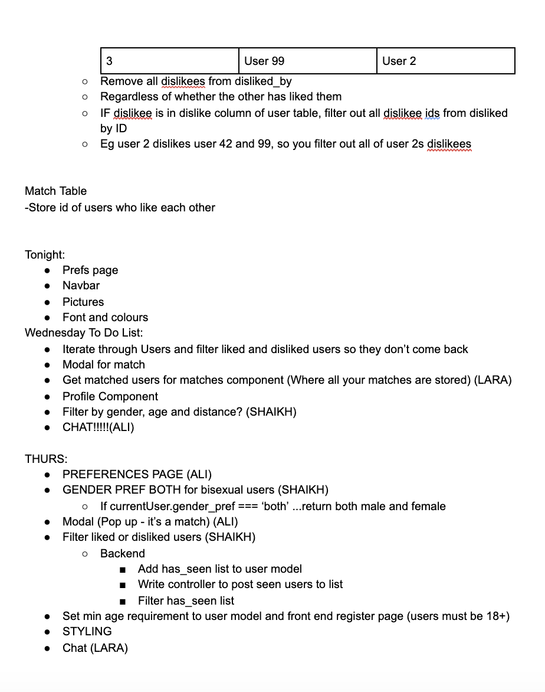

# Pavlova - A Flask and React App

# Overview

This project was my final project at GA. I worked in a group of 3 over the course of a week to build a Flask and React app. My team decided to build Pavlova - a dating app where users can select preferences to filter other users who they see. When they come across these users they can like or dislike them, creating a match when two users match. This app differed from other projects which I had been on as it heavily focused on designing complex logic to match the users, this being the biggest and most time-consuming challenge that we faced.  

As a team, we worked to set up the backend, creating the schemas and models and defining the relationships as a group. When we split off to do independent components, I worked on how to use Cloudinary so that users could upload images, how to match users and how to display these matched users in a Matches component. 

Although we achieved our MVP, we were unable to implement a chat feature whereby matched users were able to start conversations as we ran out of time. In the future, I would like to explore how to use websockets to do this. Additionally, I would like to implement another feature we were hoping to do which allowed users to set their location and filter other users depending on how far they lived from each other. 

# Brief

Listed below are the requirement that our team had to meet whilst building the app:

We had to:

- build a full-stack application by making our own backend and our own front-end
- use a Python Flask API using a Flask REST Framework to serve your data from a Postgres database
- Comsume our API with a separate front-end built with React
- Be a complete product which meant we had to include multiple relationships with CRUD functionality for the models 
- design thoughful user stories/wireframces that were significant enough to let us know which features were core MVP and which could be cut out
- be deployed online


# Technologies Used

- JavaScript
- Python 
- CSS
- HTML
- SQLAlchemy 
- Flask
- Flask-Marshmallow
- React Hooks
- Axios
- Bcrypt
- Figma
- Google Docs
- Cloudinary


# Approach

## Planning 









In order to plan our task we used Figma and GoogleDocs. This allowed us to have a shared understanding of what the final result should look like and meant that we could work independently whilst producing consistent styling. Additionally, we were able to plan the logic behind our SQLAlchemy tables. Although time-consuming, this was essential as it helped us to implement the correct logic when creating the functionality of the app. 

## App set-up

When setting up the app, we started by creating the back-end. We used Flask to do this and integrated this with SQLAlchemy (which we used to access our SQL database) by using flask-sqlalchemy. After doing this, we created our models so we could define the structures of our database table. We also created our tables and seeded data into our database. In order to retrieve this data from our database and convert it into JSON, we used Marshmallow. 

## Models and Schemas

In our project, we had the following models:

  - base (all models had columns which indicated when they were updated and created)
  - user (included user id, email, first name, last name, hashed password, date of birth, age preferences, gender and gender preferences, location (we were not able to implement this), personal bio, image and the users they have seen on the app(this allowed for users to only come across another user once))
  - likes (id's of the person who likes someone and also the person being liked)
  - dislikes (id's of the person who dislikes someone and also the person being disliked)
  - matches (id's of the two people who have matched)

  The user model also used decorators and bcrypt in order to hash the password and generate a token for the user. 

  Below is an example of our user model:

  ```
  class User(db.Model, BaseModel):

  __tablename__ = 'users'

  id = db.Column(db.Integer, primary_key=True)
  email = db.Column(db.String(128), nullable=False, unique=True)
  first_name = db.Column(db.String(128), nullable=False, unique=True)
  last_name = db.Column(db.String(128), nullable=False, unique=True)
  password_hash = db.Column(db.String(128), nullable=False)
  dob = db.Column(db.DateTime(), nullable=False)
  age_pref_min = db.Column(db.Integer(), default=18, nullable=True)
  age_pref_max = db.Column(db.Integer, default=70, nullable=True)
  gender = db.Column(db.String(6), nullable=False)
  gender_pref = db.Column(db.String(128), nullable=True)
  location_longitude = db.Column(db.Float(20), nullable=True)
  location_latitude = db.Column(db.Float(20), nullable=True)
  location_distance = db.Column(db.Integer(), nullable=True)
  bio = db.Column(db.String(5000), nullable=True, unique=True)
  image_1 = db.Column(db.String(300), default='https://i.imgur.com/URvELMh.png', nullable=True)
  has_seen = db.Column(db.ARRAY(db.Integer()), default=[0], nullable=True)

  ```

  Designing the models was very time-consuming, most notably due to the difficulty in determining the relationships between the tables and determining whether relationship were one-to-many or many-to-many. Eventually we determined that the relationships were many-to-many, however, this required us to change our code dramatically and was very time-consuming. 

  After we created the models, we created the schemas, nesting the User schemas to create relationships between the schemas. 

  ## Controllers

  When designing the routes for our app, we created controllers for our user and for our logic (likes, dislikes, matching). All these controllers (apart form login and register) use decorator functions to ensure that only registered and logged in users can use the app. 

  ### User Controllers
- `/register` (POST) --> registers a user
- `/preferences/user` (PUT)
- `/preferences/user` (GET)
- `/login` (POST)

### Logic Controllers
- `/users` (GET) -> gets all users
- `/likes` (GET, POST) -> gets a record of a users likes and posts a like when a new user is liked
- `/dislikes`(POST) -> posts a dislike when a user dislikes another user
- `/seen` (POST) -> maintains a record of all other users a user has seen to ensure they do not show up again on their app
- `/matched/<int:id>` (GET) -> this gets a record of two users who have matched (they have both 'liked' each others profiles)
- `/matches` (GET) -> this gets a record of all of a users matches

I collaborated with another member of my team to design the logic for liking, disliking and matching users. 

```
@router.route('/likes', methods=['GET', 'POST'])
@secure_route
def like():
  like_data = request.get_json()
  like_instance = Like(
    liker_id=g.current_user.id,
    liked_id=like_data['liked_id']
  )
  like_instance.save()
  likers_of_user=Like.query.filter_by(liked_id=g.current_user.id, liker_id=like_data['liked_id']).first()
  if not likers_of_user: 
    return like_schema.jsonify(like_data)
  else:
    match = Match(
      user_1_id=likers_of_user.liked_id,
      user_2_id=likers_of_user.liker_id
    )
    match.save()
    return "Match"
```

On the front-end, when a user clicks the 'like' button on another users profile, the `like()` function is run. After being converted into JSON, a new instance of a Like is created and the `liker_id` is set to be the current user and the `liked_id` (the person that is being liked) is set to be the `liked_id` from the JSON object. When the like has been saved, the function checks whether the liked user has already liked the other user - if this is the case, a 'match' will occur. In order to do this, we filtered the query to see whether the current user had been liked by the user who they had just liked:

`likers_of_user=Like.query.filter_by(liked_id=g.current_user.id, liker_id=like_data['liked_id']).first()`

If there is no match, the serialized data response is returned, else, if there is a 'match', this is posted to the matches table. 

```
@router.route('/dislikes', methods=['POST'])
@secure_route
def dislike():
  dislike_data = request.get_json()
  dislike_instance = Dislike(
    disliker_id=g.current_user.id,
    disliked_id=dislike_data['disliked_id']
  )
  print(dislike_instance)
  dislike_instance.save()
  return dislike_schema.jsonify(dislike_data)

```

Similarly, when a user dislikes another user, this is posted to the dislike table. 

When users like/dislike another user, the others users id is saved to the 'has_seen' column of the User table. The user id's are stored as an array and this means that the logged in user will not come across them again. 

```
@router.route('/matches', methods=['GET'])
@secure_route
def matches():
  matches = Match.query.filter((Match.user_1_id==g.current_user.id) | (Match.user_2_id==g.current_user.id)).all()
  my_list = []
  for match in matches:
    if match.user_1_id != g.current_user.id:
      my_list.append(match.user_1_id)
    else:
      my_list.append(match.user_2_id)
    #append that user id to the list
  query = User.query.filter(User.id.in_(my_list)).all()
  # match_instances = matches.query.filter_by(matches.id)
  # print(match_instances)
  print(type(matches))
  return user_schema.jsonify(query, many=True)
```

When creating the route which provided a list of all the users matches, we initially struggled as we had to work out how to query two columns in a table. By using the logical OR (|) operator, we were able to search if the current user was present in either the Match.user_1_id or the Match.user_2_id column and return all the instances of this. The user id of the matched user was then added to the `my_list` array. By querying the User table with the matched user id, all of the matched users could then be returned. 


# Front-end

Our app had the following components:

```
          <Route exact path='/' component={Splashscreen} />
          <Route exact path='/register' component={Register} />
          <Route exact path='/login' component={Login} />
          <Route exact path='/pavlova' component={Users} />
          <Route exact path = '/preferences' component={Preferences} />
          <Route exact path = '/matches' component= {GetMatches} />
          <Route exact path = '/images' component={Images} />
          <Route exact path = '/user/:id' component={MatchedProfile} />
```

 In order to save time, we each worked on different components. My focus was work independently on the images (`/images`) and matches components (`/matches`) whilst working collaboratively on the other components. 

 ## Images

 In order for a user to upload images onto the profile, I used the Cloudinary library. 

 This meant I could create a pop-up widget which allowed the user to upload a picture which was then saved in state. Every time the user changed their image, this ran a useEffect which sent a PUT request and updated the users profile image. In the future, I would improve this feature by allowing the user to upload multiple images. This would require me to save the default state of the images as an array and later map over this array of images to display them on the page. 

 ```
   useEffect(() => {
    const token = localStorage.getItem('token')
    axios.put('/api/preferences/user', { image_1: images }, { headers: { Authorization: `Bearer ${token}` } })
      .then()
    console.log('you have posted')

  }, [images])
 ```

 ## Matches 

To display all of the users matches, I made a GET request, saving the matches data in state. By mapping over this data, I was able to display the profiles of the matched users as well as informing the user how many matches they had. I used a terniary operator to give the user the option to keep swiping if they had no matches. 


## Challenges

- Time-constraints: when starting this project, we had only learnt Python for 1 week and therefore, as we were not very familiar with the framework, we had to spend a lot of time doing independent research whilst working towards meeting the deadline. Although we worked to resolve these, we were pushed for time and therefore, were not able to implement the location or chat features. 

- Table relationships: we spent the first few days of our projects planning and designing our tables. However, after reflecting, we realised there was a more efficient way to design the tables and therefore, had to refactor our code. This used a lot of time and emphasised the importance of planning to me. 

- Filtering users: we had to filter users based on the logged in users preferences which related to gender and age. Additionally, we realised we had to apply a 'seen' filter to ensure that once a user had swiped past another user, they did not show up again on their profile. This was not something that we had considered at the first and therefore, resulted in us changing our models mid-way through the project. 

## Lessons Learnt

- Planning: the complexity of the logic in this project emphasised the importance of planning to me. Despite using Figma and Google Docs to support the planning of our code and design, we still ran into problems as we did not consider the table relationships deeply enough. From this, I recognise that despite being keen and excited to start coding projects, ensuring that you have pre-planned all aspects in detail is essential and saves time in the long-run. 

- Project-set up: compared to previous projects I have done, the code in this project was broken into smaller components and the layout was clear - this made it very easy to navigate through the code and made it clear for me to understand. 

- Independent research: as mentioned, we had only done Python for 1 week prior to this project and therefore, we were required to do a lot of indepdendent research to understand how to implement different functionalities. This has improved my ability to read documentation and this is something that will help when completing projects into the future. 

## Future Features 

As mentioned, we were quite pushed for time and therefore did not implement all the features that we wanted. In the future, I would like to implement:

- Chat: when users match, they would be able to instantly start a conversation with each other using web-sockets

- Location preferences: you could set your location radius preferences so that you are only shown users within your desired distance

- Multiple images: users could upload multiple images to their profiles. This could be done using Cloudinary. 


